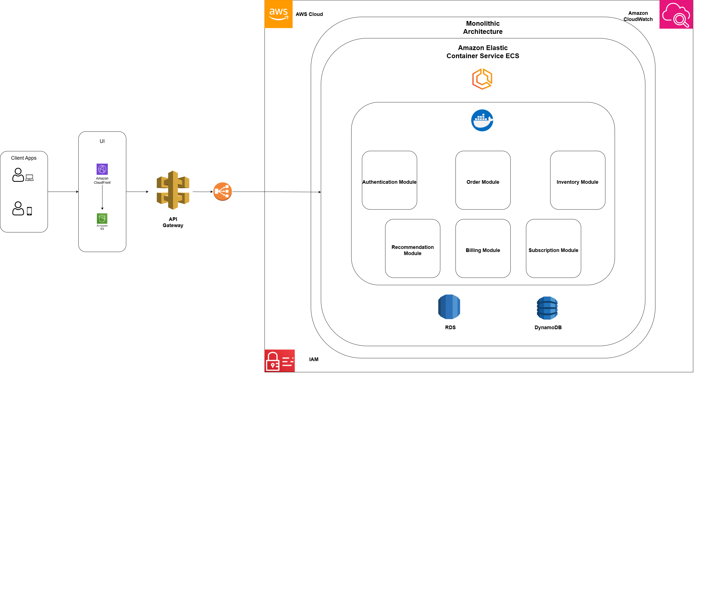
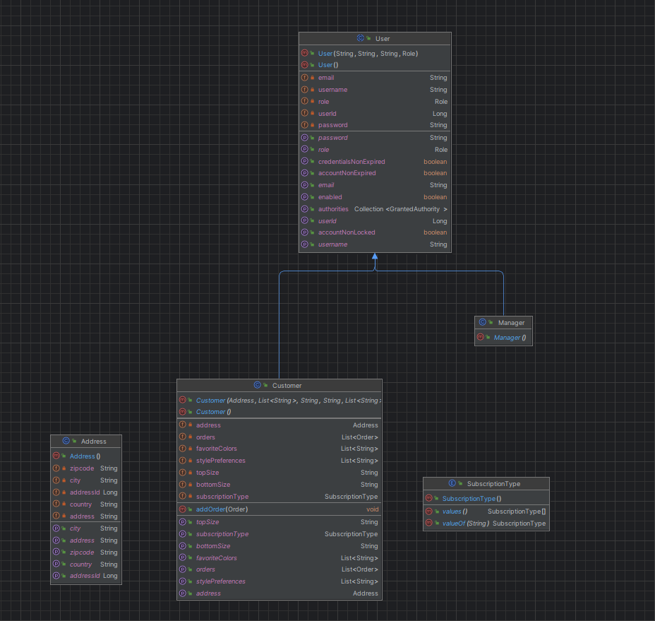
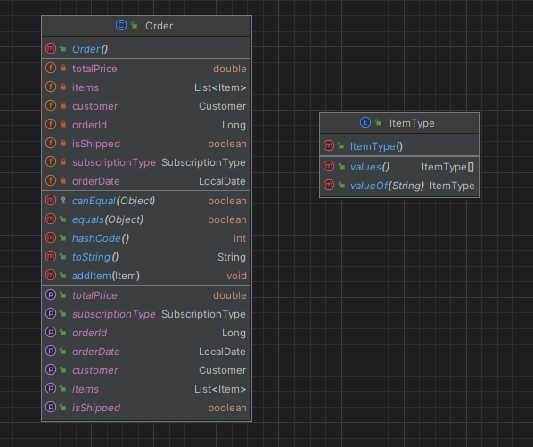
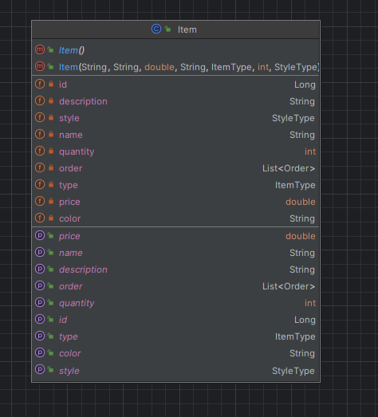
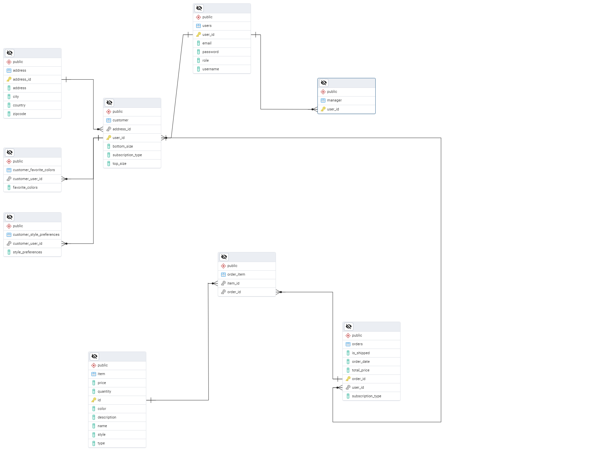

# Project Statement: Custom Clothing Mystery Box Subscription Service

## Objective
To create a web platform that provides a subscription-based mystery box service, offering personalized clothing selections based on each customer’s style preferences. The service will feature three membership levels, enabling customers to receive monthly shipments of curated clothing items and accessories.

## Description
The subscription service offers three distinct membership tiers:

1. **Upper Body Box** – $29.99 per month:  
   Includes personalized selections of tops, such as T-shirts, blouses, and sweatshirts, based on user style preferences and color choices.

2. **Lower Body Box** – $39.99 per month:  
   Provides customized bottoms, including pants, jeans, and skirts, suited to the customer’s chosen styles, fits, and color preferences.

3. **Full Combo Box** – $59.99 per month:  
   A complete package that includes items from both upper and lower body categories, along with two or more accessories (e.g., belts, scarves, hats) to enhance the customer’s style.

The system curates items each month based on a style questionnaire completed during registration, which captures details such as favorite colors, disliked colors, preferred clothing fits, and personal style preferences. Each monthly box will be unique, with no repeated items, ensuring freshness and variety. Customers can manage their subscriptions, view past shipments, and update their style preferences through their account portal.

## Features
1. **Customer Registration and Style Questionnaire**: Customers sign up, complete a style profile, and choose a membership tier.
2. **Membership Tiers**: Three subscription options tailored to customer needs and budget.
3. **Automated Monthly Curation**: The system generates a unique monthly box based on each customer’s preferences and past box history to avoid item repetition.
4. **Admin Dashboard**: Enables administrators to view and manage customer profiles, oversee curated items, and review box content before shipment.

## Manager Functionalities
- **Customer Management**: View and edit customer profiles, monitor active and inactive subscriptions, and assist with profile updates.
- **Inventory Control**: Track item availability to ensure proper selection for each mystery box.
- **Subscription Box Assembly**: Preview curated boxes and make manual adjustments if needed.
- **Order Fulfillment**: Mark boxes as shipped, track deliveries, and handle any order-related issues.

## Pricing Strategy
The pricing reflects a balance between quality and affordability, aimed at fashion-conscious individuals seeking variety and convenience. The Full Combo Box offers the best value with a broader selection of items, targeting those interested in complete looks each month.

## Impact
This service combines fashion personalization with the excitement of mystery boxes. It caters to customers looking for curated, stylish apparel while allowing them to discover new trends and expand their wardrobe monthly.

# Requirements Analysis

## Functional Requirements
These define the specific features and operations the system must perform:

### Customer Features
#### Registration and Profile Management:
- Customers register with email credentials.
- Fill out a style questionnaire (favorite colors, disliked colors, preferred fits, personal style preferences).

#### Subscription Management:
- Choose one of the three membership tiers:
  - **Upper Body Box**
  - **Lower Body Box**
  - **Full Combo Box**
- View, renew, or cancel subscriptions.

#### Order Management:
- View monthly curated box details (after shipment).
- View order history.
- Update style preferences at any time.

### Manager Features
#### Customer Management:
- View, edit, and deactivate customer profiles.
- Assist customers in updating their preferences or subscriptions.

#### Inventory Management:
- Monitor inventory levels to ensure items are available for monthly curation.
- Add new inventory items with attributes (type, size, color, style tags).

#### Order Fulfillment:
- Mark orders as shipped.
- Manage tracking numbers and monitor delivery status.

---

## 2. Non-Functional Requirements
These address the system's performance, usability, and scalability:

### Performance:
- The system should handle concurrent users (1000+ active users at peak).
- Monthly curation must process boxes for all customers within a 1-hour batch job.

### Scalability:
- Accommodate future growth to 10,000+ users.
- Support adding new subscription tiers or customization options.

### Reliability:
- Maintain 99.9% uptime.
- Secure database backups to prevent data loss.

### Security:
- Implement Spring Security for user authentication and role-based access control (RBAC).
- Use HTTPS for secure data transmission.
- 

# Architecture Diagram - Monolythic Architecture

## 1. Frontend Layer
- **React Application**: Hosted on AWS S3 and CloudFront, optimized for global access.
- **Connection**: Direct HTTPS connection to **API Gateway**.

## 2. API Gateway Layer
- **Component**: AWS API Gateway
- **Purpose**: Manages external access, handling:
  - Routing: Directs requests to the appropriate backend endpoint.
  - Authentication & Authorization: Ensures secure access.
  - Rate Limiting: Controls traffic to prevent overloading the backend.

## 3. Load Balancer Layer
- **Component**: AWS Elastic Load Balancer (ELB)
- **Purpose**: Balances traffic across multiple Docker containers of the monolithic backend service.
- **Connection**: 
  - Connected to API Gateway, which routes requests to the Load Balancer.
  - Load Balancer distributes requests across backend instances.

## 4. Backend Service Layer (Monolithic with Docker)
- **Technology**: Java Spring Boot application, now Dockerized and deployed on ECS or EC2 instances.
- **Dockerization**:
  - Each module (User, Inventory, Order, and Authentication) is packaged within the same Docker container as part of a single monolithic service.
  - A Docker image is created for the monolithic application, allowing consistent deployment across instances.
- **Components within Backend**:
  - **User Module**: Manages user profiles.
  - **Inventory Module**: Manages product data.
  - **Order Module**: Handles orders.
  - **Subscription Module**: Handles Subscriptions.
  - **Billing Module**: Handles Billing module.
  - **Authentication (JWT)**: Validates user authentication using JWT.
- **Deployment**:
  - Hosted on **AWS ECS (Elastic Container Service)** with Docker containers running the monolithic backend.
  - ECS allows orchestration and scaling of Docker containers based on traffic.
- **Connection**:
  - All requests are handled internally by the single Dockerized monolithic service, simplifying module communication.

## 5. Database Layer
- **RDS for MySQL**: Stores main data (users, orders).
- **DynamoDB**: Stores inventory data (if necessary).
- **Security**: AWS Secrets Manager handles credentials securely.

## 6. Management and Monitoring Tools
- **Admin Dashboard**: Part of the monolithic backend, accessible internally.
- **Monitoring and Logging**: AWS CloudWatch monitors and logs Docker container performance.

## Docker Integration Summary
- **Docker Image**: Package the monolithic Java Spring Boot app as a Docker image.
- **AWS ECS**: Deploy this Docker image on ECS, leveraging ECS to manage and scale containers based on load.
- **Scalability**: The Load Balancer can route requests to multiple instances of this Dockerized monolithic service.
- **Consistency and Portability**: Docker ensures that the application runs consistently across environments.

## Full Monolithic Architecture with Docker Summary
1. **Frontend (React App)** → **API Gateway**
2. **API Gateway** → **Load Balancer (ELB)**
3. **Load Balancer (ELB)** → **Monolithic Backend (Dockerized Java Spring Boot on ECS)**
4. **Monolithic Backend (Docker)** ↔ **Databases (RDS and DynamoDB)**



# Software Modeling

## Class Diagram




## ER Diagram


# Guide: Running the Mystery Box Subscription Service Project

This guide outlines the steps to run your project locally and in the cloud.

---

## **Running the Project Locally**

### Prerequisites
1. **Java Development Kit (JDK):**
   - Ensure Java 17 or later is installed.
2. **Maven:**
   - Install Maven 4.0 or higher.
3. **PostgreSQL Database:**
   - Install PostgreSQL and create a database for the project.
4. **Environment Variables:**
   - Set up the following variables in your `application.properties` or as environment variables:
     ```properties
     spring.datasource.url=jdbc:postgresql://localhost:5432/mysterybox
     spring.datasource.username=<your_database_username>
     spring.datasource.password=<your_database_password>
     spring.jpa.hibernate.ddl-auto=update
     jwt.secret=<your_jwt_secret>
     ```
5. **Postman or Similar Tool:**
   - For API testing, install Postman or a similar REST client.

### Steps
1. **Clone the Repository:**
   ```bash
   git clone <repository_url>
   cd <repository_folder>
   
2. **Install Dependencies:**

   -Navigate to the project directory and run:
   ```bash
   mvn clean install
   Run PostgreSQL:

3. **Ensure PostgreSQL is running, and the database is accessible at the URL specified in your application.properties.**
   -Start the Application:

   -Run the application:
   ```bash
   mvn spring-boot:run
   
The application will start on the default port (usually http://localhost:8080).

4. **Test with Postman:**

   -Use Postman to test endpoints, e.g., user registration, login, and subscription creation.

## **Running the Project in the Cloud**

### **Prerequisites**

1. **AWS Account:**
   - Log in to your AWS Management Console.
   - [Sign up for AWS](https://aws.amazon.com/)

2. **Docker:**
   - Install Docker and configure it with your AWS CLI credentials.
   - [Download Docker](https://www.docker.com/products/docker-desktop)

3. **AWS Services:**
   - Set up the following:
     - **AWS ECS**: For deploying your Dockerized application.
     - **AWS RDS**: For your PostgreSQL database.
     - **AWS S3/CloudFront**: For hosting the React frontend (optional).

4. **Environment Variables:**
   - Configure environment variables in the ECS task definition:
     ```properties
     spring.datasource.url=jdbc:postgresql://<rds-endpoint>:5432/mysterybox
     spring.datasource.username=<your_rds_username>
     spring.datasource.password=<your_rds_password>
     spring.jpa.hibernate.ddl-auto=update
     jwt.secret=<your_jwt_secret>
     ```

### **Steps**

1. **Create and Push Docker Image:**

   - Build the Docker image:
     ```bash
     docker build -t mysterybox-service .
     ```

   - Tag the image for ECR:
     ```bash
     docker tag mysterybox-service:latest <your_ecr_repository>:latest
     ```

   - Push the image to ECR:
     ```bash
     docker push <your_ecr_repository>:latest
     ```

2. **Set Up RDS Database:**

   - Create a PostgreSQL instance in AWS RDS.
   - Note the endpoint, username, and password.

3. **Deploy to ECS:**

   - Create an ECS cluster.
   - Define a new task with the following configurations:
     - **Container Image**: `<your_ecr_repository>:latest`
     - **Environment Variables**: Add the variables mentioned above.
     - **Port Mappings**: Map port 8080.
   - Run the task in the cluster.

4. **Test the Cloud Deployment:**

   - Use the public IP or DNS of the ECS service to test your application.
     Example:
     - Endpoint: `http://<ecs-public-ip>:8080/api/login`
     - Body (JSON):
       ```json
       {
         "username": "user@example.com",
         "password": "password123"
       }
       ```

5. **Monitor and Debug:**

   - Use **CloudWatch Logs** to view logs from your ECS tasks.
   - Ensure the **RDS instance security group** allows connections from ECS.

